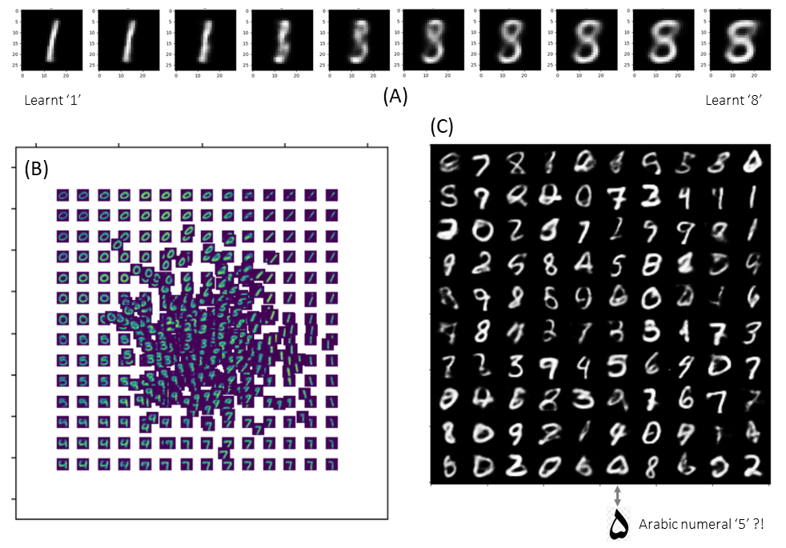

# Out of Distribution responses of Variational Auto Encoders (VAEs)

VAEs allow the generation of new images by interplotating among their training-set images. Previous studies [1] suggest VAEs respond to Out-Of-Distribution (OOD) test inputs with a weighted sum of the nearest learnt patterns. Sampling concave/discontinuous areas of training set latent space can sometimes generate unexpected and unlikely outputs (see schematic). 

This notebook explores and demonstarets these issues by training a VAE on the MNIST hand-written digits data set, and then sampling and visualizing the VAE's latent space. For ease of visualization, the model's latent space has just 2 dimensions. The images below  show (A) example image interpolations, (B) example latent-space organization, and (C) example "unexpected outputs".

## Citation

[1] Bozkurt et al, "Can VAEs Generate Novel Examples?", 32nd Conference on Neural Information Processing Systems (2018), Montréal, Canada, arXiv:1812.09624v1